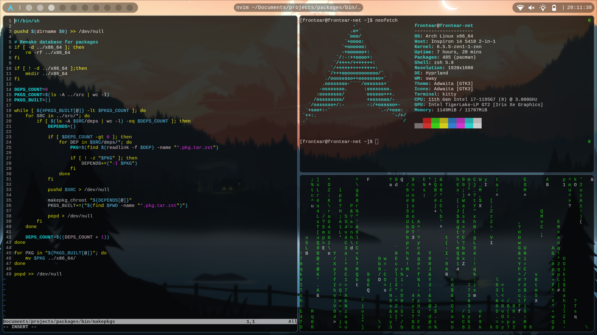

# Frontear's dotfiles
- **OS**: Arch Linux 
- **Compositor**: Hyprland 

## Screenshots

<div>
    
    
</div>

## Installation
Install the following packages:

```
# yay -Syu apple-fonts aylurs-gtk-shell-git cliphist devtools ffmpeg ffmpegthumbnailer firewalld git google-chrome grimblast-git hyprland-git imagemagick inotify-tools kitty linux-zen ly mlocate neofetch neovim networkmanager openssh perl-image-exiftool pipewire pipewire-alsa pipewire-audio pipewire-jack pipewire-pulse profile-sync-daemon python-pillow qt5-wayland ranger reflector sassc swaybg ttf-nerd-fonts-symbols wireplumber wl-clip-persist-git xdg-desktop-portal-gtk xdg-desktop-portal-hyprland-git zsh zsh-completions
```

If your shell is anything _but_ `/bin/zsh`, switch it via [usermod(8)](https://man.archlinux.org/man/usermod.8.en), otherwise translate the various zsh files into your desired shell (and omit installation of zsh* from the above packages).

You may omit whichever packages you wish to from the above listing, supplementing them with your own (**systemd-networkd** instead of **NetworkManager**, **firefox** instead of **google-chrome**), just be aware of the configurations you will need to change or fix (wifi module for ags, psd config for firefox). You may also skip them entirely, just be aware that certain things will not work.

Once packages have been installed, enable some systemd services to get them to work. Once again, enable/disable at your own discretion following whatever you chose to use:
```
For ly:
# systemctl disable getty@tty1.service
# systemctl enable ly.service

For network:
# systemctl enable NetworkManager.service

For firewall:
# systemctl enable firewalld.service

For systemd-boot:
# systemctl enable systemd-boot-update.service

For time syncing (enables systemd-timesyncd.service):
# timedatectl set-ntp true

For SSDs:
# systemctl enable fstrim.timer

For ext4 scrubbing:
# systemctl enable e2scrub_all.timer

For updated pacman mirrors:
# systemctl enable reflector.timer

For profile-sync-daemon:
$ systemctl --user enable psd.service
```
